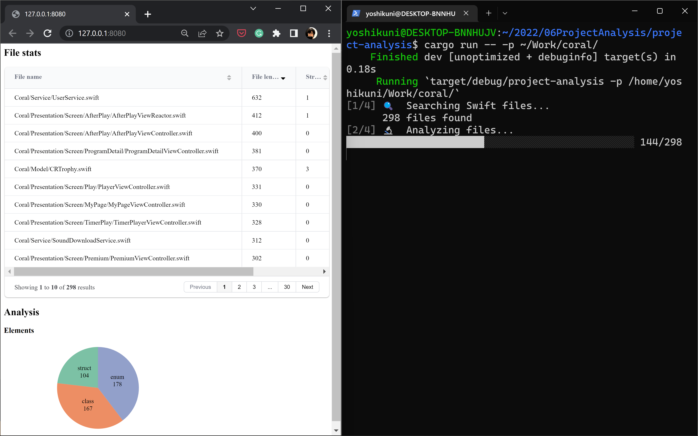

# Swift Analyzer

The bare minimum analyzer of Swift projects.



## Features
- For each file, count file length, `struct`, `class`, and `enum`
- For the entire project, count `struct`, `class`, and `enum`
- And show them in a web UI✨
    - A little bit of [D3](https://d3js.org/) use to render a pie chart

## How to run

```sh
$ cargo run -- -p path_to_project_root
```

## Motivation
- I was interested in objectively comparing multiple Swift projects because I've made a lot of iOS apps from scratch during my career.
- I picked up Rust here only because I wanted to learn the language.
- During this development, I realized that using [SwiftSyntax](https://github.com/apple/swift-syntax) was more suitable for in-depth analysis using Abstract Syntax Tree. Therefore, I made another project.
